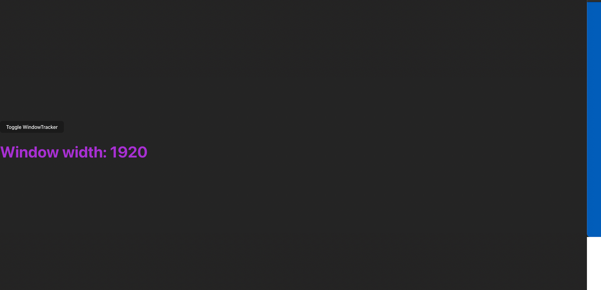

# Window Width Tracker (React)

This is a simple React application that tracks and displays the width of the browser window in real-time. It was built as a practice project to explore the usage of the `useEffect` hook in functional components.

## ✨ Features

- Displays the current width of the browser window.
- Updates dynamically when the window is resized.
- Demonstrates how to use `useEffect` for setting up and cleaning up event listeners.

## 🧠 What I Practiced

This project was created to practice and understand the `useEffect` hook in React. Key concepts included:

- Running side effects in functional components.
- Adding and removing event listeners properly.
- Cleanup functions to avoid memory leaks.

## 🚀 Getting Started

### Prerequisites

- Node.js and npm installed on your machine.

### Installation

1. Clone the repository:
   ```bash
   git clone https://github.com/wesleyajavon/window-width-tracker.git
   cd window-tracker-react
   npm install
   npm run dev

## 📸 Preview


